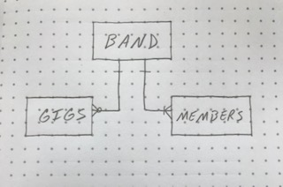
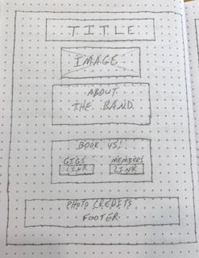

# Band App
My Project 2 is an application modeled after a marching band of which I am a member - Seed & Feed Marching Abominable.
Band members will have the ability to view, add, update, and delete bands, gigs, and members text and images.

# Technologies Used

1. Github - https://github.com/rosenkrans/band-app 
1. Trello - https://trello.com/b/sQ6Or0KD/band-app 
1. Heroku - https://band-app-seednfeed.herokuapp.com/bands 

# Coding languages and libraries

* HTML
* CSS
* JavaScript
* Node.js
* Bootstrap
* Express
* MongoDB

## Features

* Add, view, edit, and delete band
* View list of bands
* Add, view, edit, and delete gig
* View list of gigs
* Add, view, edit, and delete member
* View list of members

## ERD:

## Wireframe:

